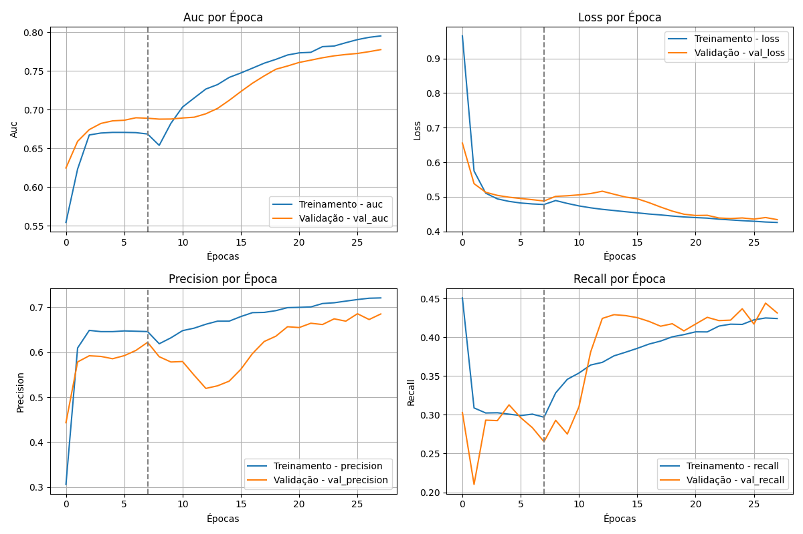

# Treinamento de redes neurais com transfer learning

📌 Neste projeto uso a técnica de Transfer Learning para classificação multilabel de atributos faciais com a rede ResNet50.

A solução está neste diretório, no notebook do Google Colab [`Treinamento_de_redes_neurais_com_transfer_learning.ipynb`](https://github.com/FlaviaLopes/dio-challenges-coding-the-future-with-baires-dev/blob/main/projeto_1/Treinamento_de_redes_neurais_com_transfer_learning.ipynb).

$Mas$ $antes$ $disso$... Entenda um pouco mais sobre o desafio.

> **Desafio:** 
"O projeto consiste em aplicar o método de Transfer Learning em uma rede de Deep Learning usando a linguagem Python e no ambiente COLAB. Neste projeto, você pode usar sua própria base de dados (exemplo: fotos suas, dos seus pais, dos seus amigos, dos seus animais domésticos, etc). O exemplo de gatos e cachorros pode ser substituído por duas outras classes do seu interesse. O Dataset criado em nosso projeto anterior pode ser utilizado agora."

🎯 **Etapas**
- Para atingir os objetivos propostos, as seguintes etapas foram realizadas:  
  1. **Escolha da base e preparação dos dados:** escolhi o dataset CelebA (ver seção 1).  
  2. **Implementação de Transfer Learning com a rede ResNet50:** retreinei a rede com as imagens do dataset selecionado (ver seção 2).  
  3. **Treinamento e validação do modelo com métricas específicas:** utilizei as métricas AUC, recall e precision (ver seção 3).

📝 **Contexto**: A seção 1 dá mais detalhes sobre a base utilizada, as seções 2 a 4 trazem mais informações sobre a rede utilizada, métricas de avaliação e o processo de transfer learning.

---
🔍 **Desempenho do modelo**
- Training phase:
	- A cabeça da rede ResNet50 foi treinada por 10 épocas com um total de 3.800 imagens. 
	> _obs_: foram escolhidas aleatoriamente para cada classe 100 imagens
- Fine tunning phase:
	- As primeiras 10 camadas continuaram congeladas, e as demais foram descongeladas para que o treinamento continuasse, a uma taxa de aprendizado menor, por mais 20 épocas.
- A imagem a seguir resume a evolução do treinamento através das métricas: AUC, Precision, Recall e loss (binary cross entropy). O traço vertical indica o início do fine tunning, onde o desempenho cai, naturalmente, mas depois começa a evoluir e convergir.

- A seguir, temos dois exemplos de celebridades brasileiras e como foram classificadas pela rede.

---
🔍 **Como o modelo classificou a minha foto**

---
## 📸 1. CelebA dataset
---
O **CelebA** é um dataset de imagens de rostos de celebridades, desenvolvido por pesquisadores da **The Chinese University of Hong Kong**. Contém mais de 202 mil imagens rotuladas com 40 atributos faciais binários, como _smiling_, _young_, _black-hair_, _brown-hair_, _blond-hair_, _big-lips_, dentre outros. É uma base bastante útil para treinamento de modelos de reconhecimento de atributos faciais.
Embora o enunciado mencione uma dataset com duas classes, optei por utilizar todas as 40 classes do dataset para explorar a complexidade da classificação multilabel.  

- **Dataset obtido em**: [CelebA no Kaggle](https://www.kaggle.com/datasets/jessicali9530/celeba-dataset)  
- **Mais informações em**: [MMLAB](http://mmlab.ie.cuhk.edu.hk/projects/CelebA.html)

## 🧠 2. ResNet50: deep leaning network
---
A **ResNet50** (Residual Neural Network com 50 camadas) é uma arquitetura de rede neural profunda introduzida em 2015 pela [Microsoft Research](https://en.innovatiana.com/post/discover-resnet-50). 

A ResNet50 foi treinada no dataset ImageNet, que contém milhões de imagens distribuídas em 1.000 categorias. Nesse contexto, a ResNet50 alcançou uma acurácia de top-5 de 92,1%, demonstrando sua eficácia em tarefas de classificação de imagens. Embora existam arquiteturas mais recentes que superam a ResNet50 em termos de acurácia, como a ResNet152V2 e as redes da família EfficientNet, a ResNet50 oferece um bom equilíbrio entre desempenho e eficiência computacional [Keras Applications](https://keras.io/api/applications/).  

A ResNet50 é uma boa escolha em tarefas de reconhecimento facial devido à sua capacidade de capturar características faciais complexas. Apesar de não ser a arquitetura mais recente, sua eficiência e robustez a tornam uma escolha confiável para essa aplicação.  

## 📊 3. Evaluation metrics
---
A métrica **AUC** (Área sob a Curva ROC) avalia a capacidade do modelo de distinguir entre classes positivas e negativas, medindo a área sob a curva ROC (Receiver Operating Characteristic).  

A métrica AUC considera tanto a taxa de verdadeiros positivos quanto a de falsos positivos, equilibrando a avaliação do modelo em cenários onde há diferenças significativas na distribuição das classes.  
A métrica Recall e precision

## 🚀 4. Entenda o processo de Transfer Learning
---
Transfer Learning é uma técnica de aprendizado onde um modelo treinado em uma base de dados é adaptado para outra tarefa semelhante, evitando o treinamento do zero e otimizando tempo e recursos.  

**Por que é útil?**  

- **Aproveitamento de conhecimento prévio:** Permite alavancar conhecimento aprendido em bases grandes, como o ImageNet.  
- **Redução de overfitting:** Especialmente importante em bases menores, onde um modelo treinado do zero pode superajustar os dados de treinamento.  
- **Eficiência computacional:** Economiza recursos ao reutilizar pesos previamente treinados.  

**Etapas de Transfer Learning neste projeto:**  

1. **Escolha do modelo base:** a rede ResNet50 pré-treinada no ImageNet foi a escolha para este projeto. 
2. **Congelamento de camadas:** As primeiras camadas da ResNet50 foram congeladas, preservando os pesos que capturam características gerais das imagens, como bordas e texturas. 
3. **Adaptação do modelo:** a última camada foi adaptada para classificar os 40 atributos do CelebA.  
4. **data selection and preparation**: 100 imagens de cada classe foram escolhidas aleatoriamente para o treinamento. Algumas imagens foram sorteadas para serem transformadas (rotação, zoom, aumento ou diminuição de contraste, brilho e saturação).
4. **Treinamento personalizado:** as novas camadas adicionadas foram treinadas com o dataset permitindo que o modelo aprendesse características específicas do CelebA.  

## 5. Conclusão

O projeto atingiu o objetivo geral, que foi a escolha de uma rede e dataset para aplicação de transfer learning. Esta solução também teve como adicional a exploração dos desafios de uma classificação multilabel. 

Depois do modelo treinado, a etapa de testes produziu um dataframe com os valores de y e ŷ. Esse dataframe será carregado no Projeto 3 deste repositório, onde será explorado o cálculo de métricas de avaliação de modelos de classificação.

Por agora é isso. Obrigada pela atenção e até a próxima.

---

**Referências:**  
- [Artigo Original ResNet](https://arxiv.org/abs/1512.03385)  
- [ImageNet Benchmark](https://paperswithcode.com/sota/image-classification-on-imagenet)  
- [AUC: Receiver Operating Characteristic](https://developers.google.com/machine-learning/crash-course/classification/roc-and-auc)  
- [Comparação de Métricas: F1, AUC, Accuracy](https://neptune.ai/blog/f1-score-accuracy-roc-auc-pr-auc)  

